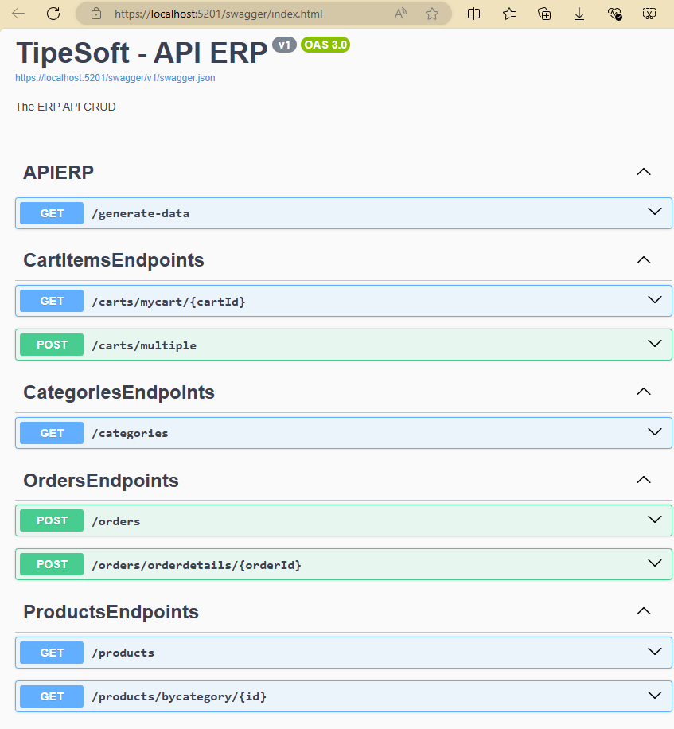
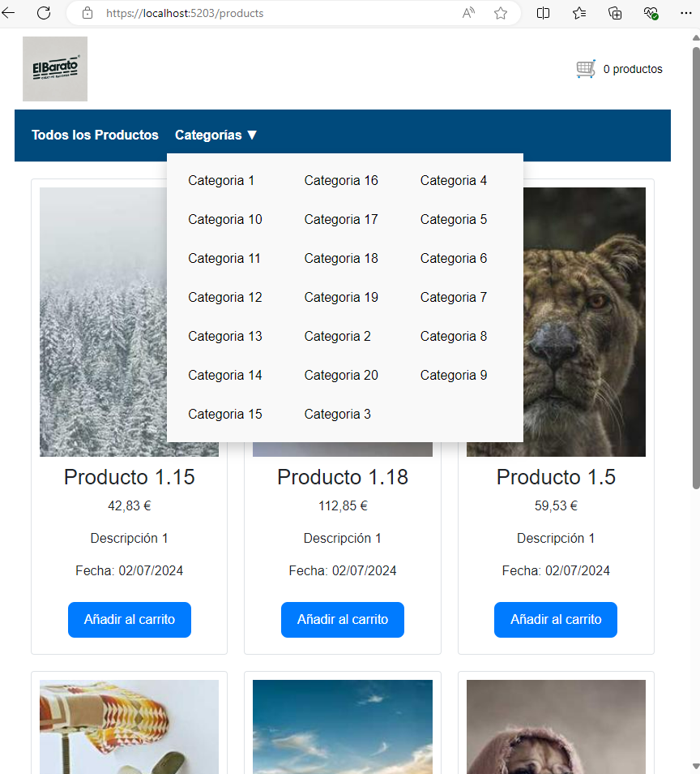
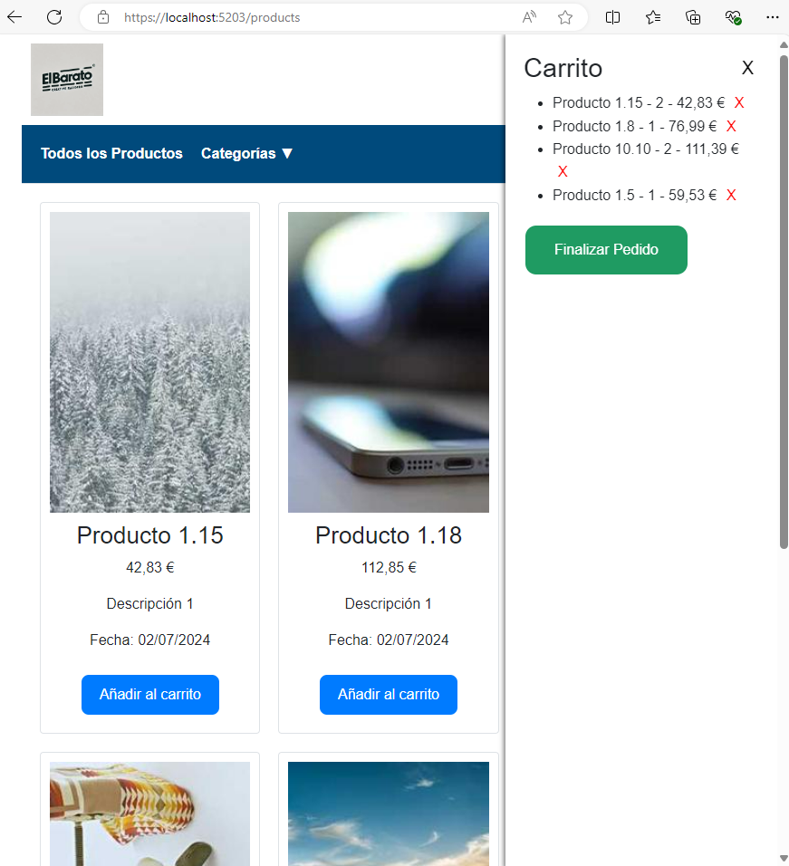
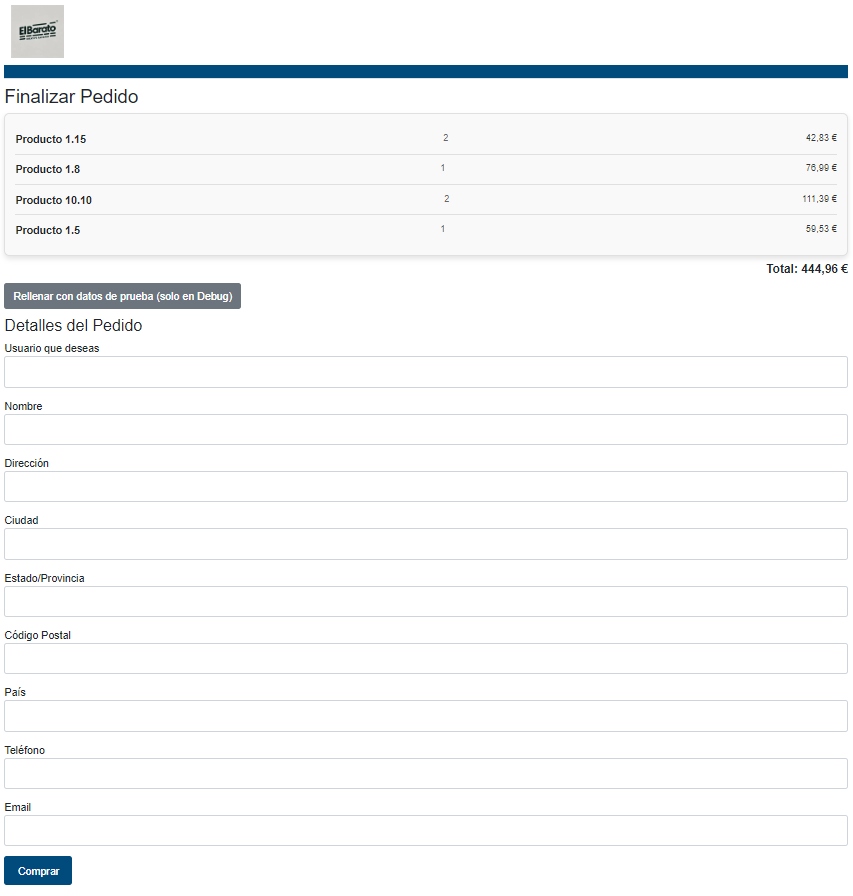
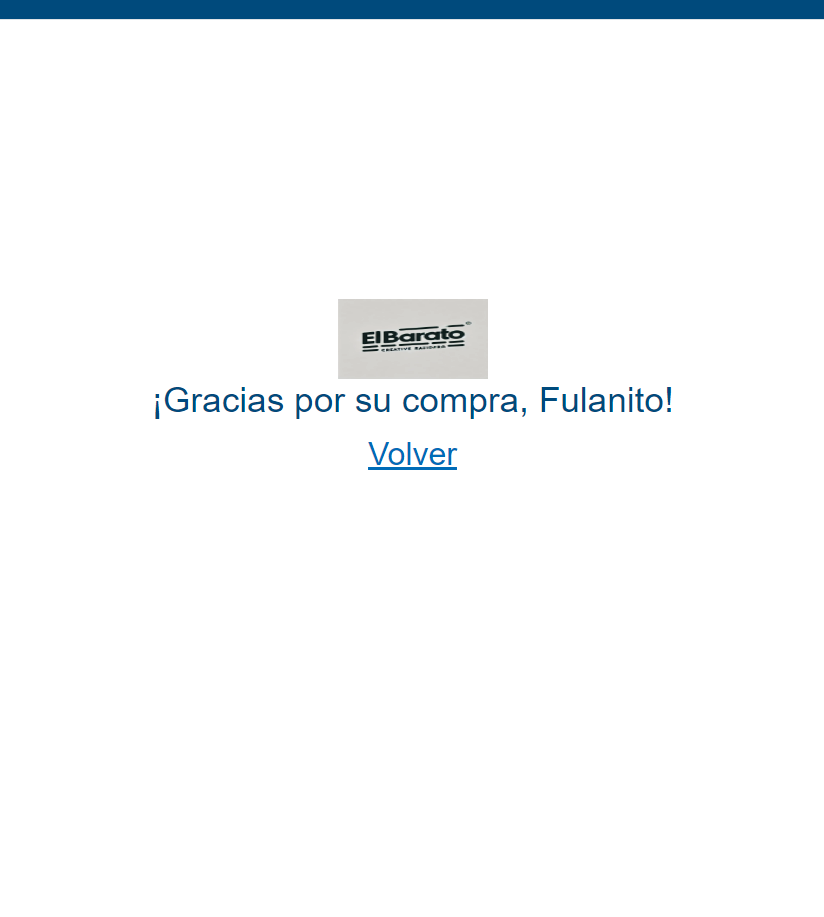

# Proyecto: API Minimas - UI con Blazor

### Curso Net Core 8 de TypeSoft

Pongo unas imágenes, a veces es más descriptivo que un texto para hacerte una idea de lo que obtendras.







### Que hacer en el proyecto

A partir del anterior proyecto APIERP (API mínima sola), crear la interfaz de usuario añadiendo un proyecto de tipo Blazor.

Sin crear sistema de usuarios, simular todo lo necesario para hacer solo esa tarea, sin sobreingenería.

Hacer lo mínimo para una tienda online que lista los productos, los añade al carrito y completa el checkout.

# Ejecutar migraciones para crear la base de datos

Dentro de la carpeta de proyecto de APIERP

```bash
dotnet ef database update
```

# Rellenar datos de pruebas

Al iniciar el proyecto de API ERP utilizar el siguiente endpoint.

```bash
https://localhost:5201/products/generate-data
```

Creará algunos productos de prueba con sus categorias.

Notas:

- En la API existen más endpoints comentados. He dejado solo los utilizados en la interfaz de usuario habilitados.
- Tiene el almacenador de archivos que puede almacenar las imágenes en wwwroot y es funcional. En blazor está comentada para sí lo quieres cambiar para trabajar con ello. Yo para no tener que subir productos con imágenes, he cambiado a un servicio de imágenes aleatorias de internet.
- Tiempo empleado 8 horas y media, las 3 primeras cambiando la APIERP desde el anterior proyecto para adaptarla a este.
